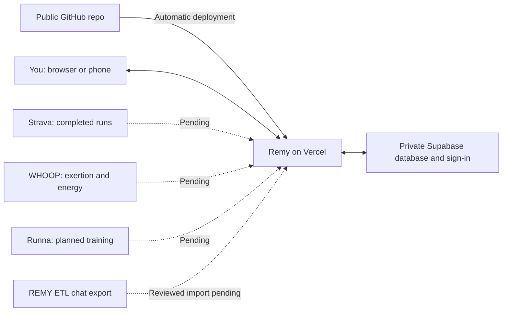

# Remy

A private Eat to Live nutrition journal with running and recovery context. The source is public; each deployed journal requires its owner's sign-in.

The Next.js application lives in [`remy/`](remy/). See the [application README](remy/README.md) for features and local development, and the [Vercel + Supabase setup guide](remy/docs/deployment.md) for deployment.

Only synthetic sample data is included. Nutrition exports, personal records, provider credentials, and local configuration are excluded from this repository.

## Architecture

The application infrastructure is live. Dashed connections show data integrations awaiting setup; Strava is the selected running source.

